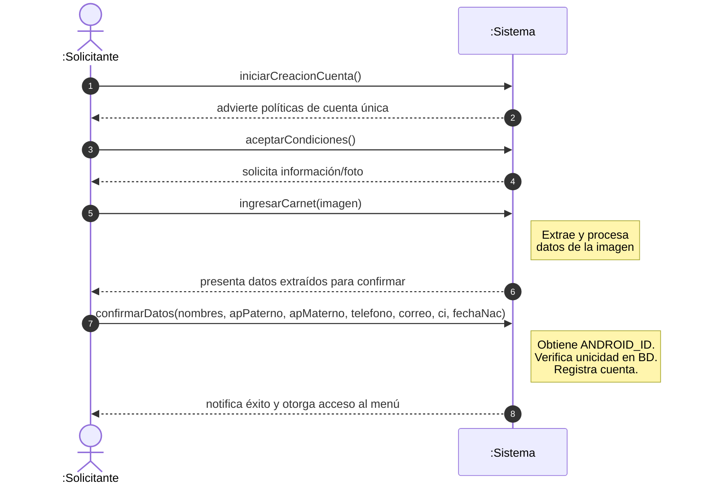
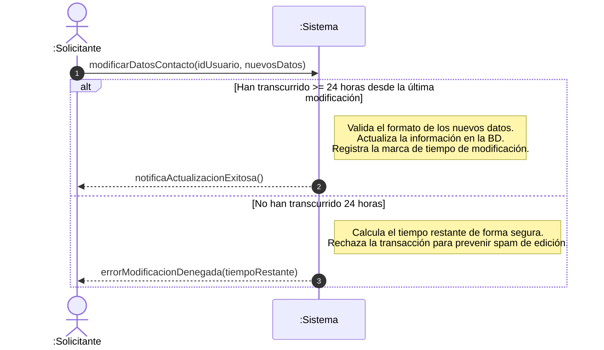
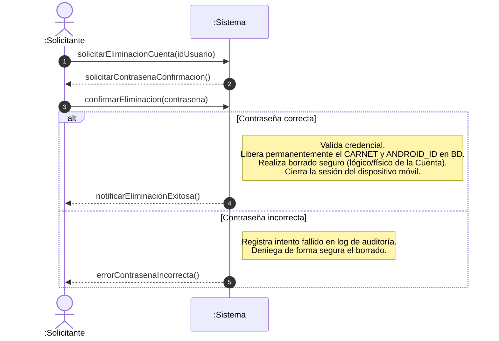
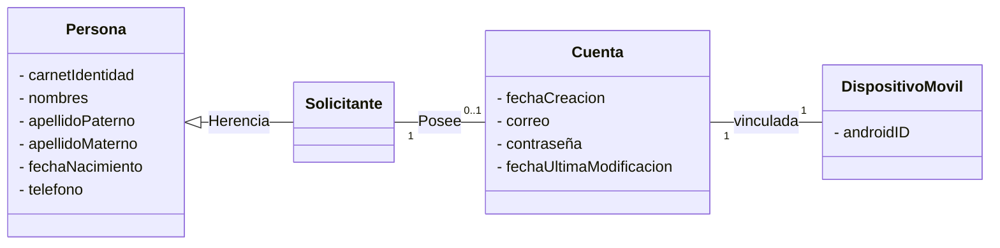
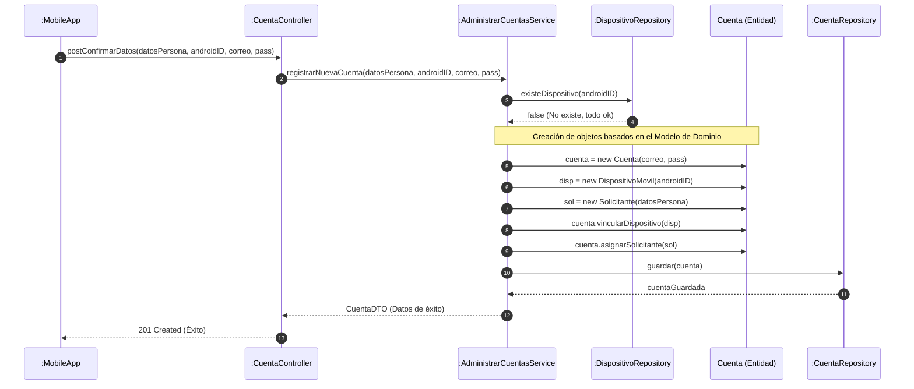
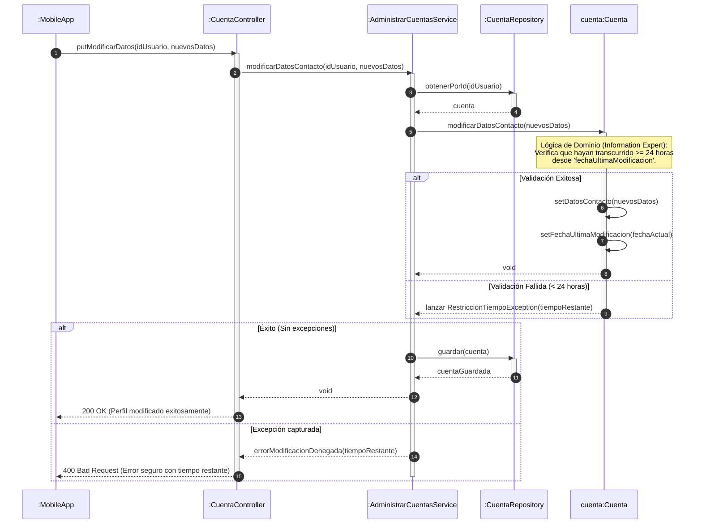
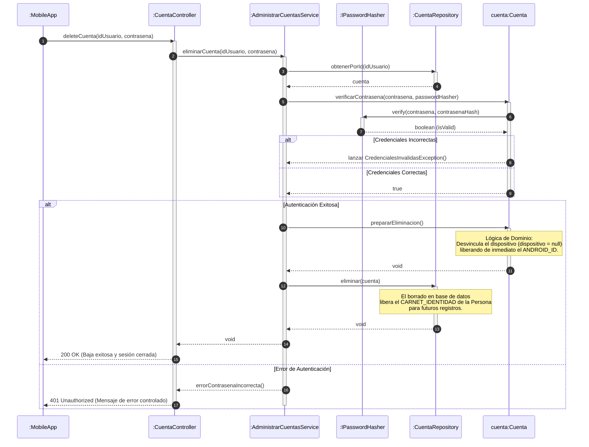
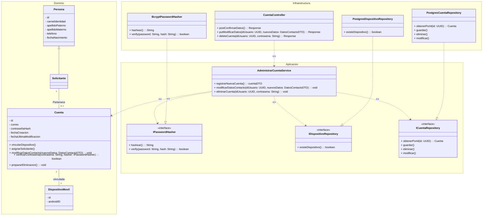

# UC0: Administrar Usuario

**Actor Principal:** El Solicitante (Paciente).[cite: 1]

**Interesados y sus Intereses:**

* **Solicitante:** Quiere crear una cuenta de forma rápida y sencilla (aprovechando la cámara de su celular) para poder reservar fichas médicas sin tener que ir a hacer fila.[cite: 1]
* **Administración del Hospital:** Quiere evitar el fraude, el acaparamiento de fichas y las reservas falsas, asegurándose de que el sistema restrinja la creación a una sola cuenta por dispositivo móvil.[cite: 1]

**Precondiciones:** El Solicitante ha descargado la aplicación móvil en su teléfono y tiene conexión a internet.[cite: 1]

**Garantías de Éxito (Postcondiciones):** Se crea y guarda una cuenta de usuario para el Solicitante. La cuenta queda asociada permanentemente a sus datos personales y al ID único de hardware de su teléfono.[cite: 1]

### Escenario de Éxito Principal (Flujo Básico):

1. El Solicitante indica al Sistema que desea crear una nueva cuenta.[cite: 1]
2. El Sistema advierte que las políticas solo permiten registrar una cuenta por teléfono móvil.[cite: 1]
3. El Solicitante acepta las condiciones.[cite: 1]
4. El Solicitante provee su información personal (nombres, apellido paterno, apellido materno, teléfono, correo, número de carnet, fecha de nacimiento) mediante la captura de una fotografía de su carnet de identidad.[cite: 1]
5. El Sistema extrae, procesa y valida los datos de la imagen.[cite: 1]
6. El Sistema solicita al Solicitante confirmar o corregir los datos extraídos.[cite: 1]
7. El Sistema obtiene el ID único del dispositivo móvil del Solicitante.[cite: 1]
8. El Sistema verifica que el ID del dispositivo no esté asociado a ninguna cuenta existente en la base de datos.[cite: 1]
9. El Sistema registra la nueva cuenta asociándola al ID del dispositivo y al número de carnet.[cite: 1]
10. El Sistema notifica la creación exitosa y otorga acceso al menú principal.[cite: 1]

### Extensiones o Flujos Alternativos:

* **3a. El Solicitante no acepta las condiciones de cuenta única:**
  1. El Sistema cancela el proceso y regresa a la pantalla de inicio.[cite: 1]
* **4a. El Solicitante decide ingresar la información manualmente:**
  1. El Solicitante teclea sus datos personales en lugar de usar la cámara.[cite: 1] 
  2. El escenario regresa al paso 7.[cite: 1]
* **5a. El Sistema no puede leer la fotografía del carnet (imagen borrosa, mala iluminación):**
  1. El Sistema advierte del error y solicita que el Solicitante tome la foto nuevamente o ingrese los datos manualmente.[cite: 1]
* **8a. El Sistema detecta que el ID del dispositivo móvil ya tiene una cuenta asociada:**
  1. El Sistema señala un error indicando que este teléfono ya fue registrado previamente.[cite: 1]
  2. El Sistema deniega la creación de la cuenta y sugiere la opción de "Iniciar Sesión" o "Recuperar Contraseña". Proceso abortado.[cite: 1]
* **9a. El número de carnet ingresado ya pertenece a otra cuenta:**
  1. El Sistema señala un error de duplicidad. Proceso abortado.[cite: 1]
* **3-10a. El Solicitante desea actualizar su perfil:**
  1. El Solicitante, ya autenticado, solicita modificar su información de contacto.[cite: 1]
  2. El Sistema verifica que hayan transcurrido al menos 24 horas desde la última modificación.[cite: 1]
  3. El Sistema valida los nuevos datos y guarda los cambios.[cite: 1]
  * **2a (Sub-variante de 3-10a). No han transcurrido 24 horas desde la última modificación:**
    1. El Sistema deniega la solicitud y muestra un mensaje indicando el tiempo restante para poder modificar los datos nuevamente.[cite: 1]
* **3-10b. El Solicitante desea eliminar su cuenta:**
  1. El Solicitante solicita la eliminación definitiva de su cuenta.[cite: 1]
  2. El Sistema solicita confirmación (por seguridad).[cite: 1]
  3. El Solicitante confirma.[cite: 1]
  4. El Sistema da de baja la cuenta, liberando el número de carnet y el ID del dispositivo, y cierra la sesión.[cite: 1]

### Requisitos Especiales:

* La extracción de texto a partir de la imagen del carnet de identidad (OCR) debe ejecutarse de manera rápida (ej. menos de 5 segundos) para no frustrar al usuario.[cite: 1]
* **Privacidad y Seguridad:** El ID único del teléfono y los datos personales deben transmitirse y almacenarse de forma encriptada.[cite: 1]

### Lista de variaciones de tecnología y datos:

* **4a.** El ingreso de datos personales puede hacerse mediante procesamiento de imagen de la cámara del celular o tecleando en el formulario.[cite: 1]
* **7a.** El "ID único del dispositivo" dependerá del sistema operativo (Android o iOS) pero debe ser un identificador de hardware persistente (como el Android ID o un UUID guardado en el Keychain que sobreviva a la reinstalación de la app).[cite: 1]

**Frecuencia de Ocurrencia:** Una vez por teléfono/dispositivo.[cite: 1]

### Problemas Abiertos:

* ¿Cuál será el proceso administrativo si un paciente sufre el robo de su celular, compra uno nuevo y necesita trasladar su cuenta al nuevo dispositivo (cuyo ID será diferente)?[cite: 1]
* ¿Cómo manejará el sistema los números de carnet de identidad en Bolivia que tienen extensiones alfanuméricas (ej. 1234567-1B)?[cite: 1]

### SSD: Escenario de Éxito Principal - Administrar Usuari

#### SSD - Escenario Alternativo 3-10a: Actualizar Perfil (Modificar Datos de Contacto)

#### SSD - Escenario Alternativo 3-10b: Eliminar Cuenta

### Modelo de Dominio – MiFicha

### OOD: Diagramas de Interacción (Secuencia / Comunicación)

#### DSD - Actualizar Perfil (Modificar Datos de Contacto)

#### DSD - Eliminar Cuenta (Con Re-autenticación y Liberación de Identificadores)

### OOD: Diagramas de Clases de Diseño (DCD)

