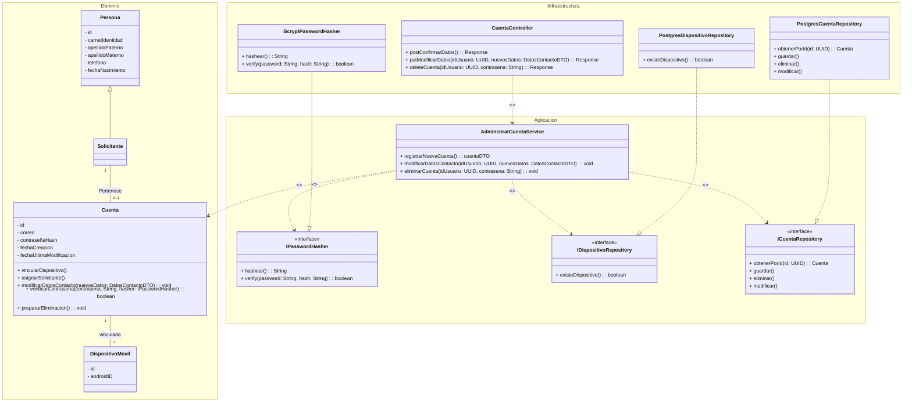

### OOD: Diagramas de Clases de Diseño (DCD)

```mermaid
classDiagram
    direction TB

    %% Capa de Dominio
    namespace Dominio {
        class Persona {
            - id
            - carnetIdentidad
            - apellidoPaterno
            - apellidoMaterno
            - telefono
            - fechaNacimiento
        }
        class Solicitante {
        }
        class Cuenta {
            - id
            - correo
            - contraseñaHash
            - fechaCreacion
            - fechaUltimaModificacion
            + vincularDispositivo()
            + asignarSolicitante()
            + modificarDatosContacto(nuevosDatos: DatosContactoDTO) : void
            + verificarContrasena(contrasena: String, hasher: IPasswordHasher) : boolean
            + prepararEliminacion() : void
        }
        class DispositivoMovil {
            - id
            - androidID
        }
    }

    Persona <|-- Solicitante
    Solicitante "1" -- "0..1" Cuenta : Pertenece
    Cuenta "1" -- "1" DispositivoMovil : vinculada

    %% Capa de Aplicación
    namespace Aplicacion {
        class AdministrarCuentaService {
            + registrarNuevaCuenta() : cuentaDTO
            + modificarDatosContacto(idUsuario: UUID, nuevosDatos: DatosContactoDTO) : void
            + eliminarCuenta(idUsuario: UUID, contrasena: String) : void
        }
        class IPasswordHasher {
            <<interface>>
            + hashear() : String
            + verify(password: String, hash: String) : boolean
        }
        class IDispositivoRepository {
            <<interface>>
            + existeDispositivo() : boolean
        }
        class ICuentaRepository {
            <<interface>>
            + obtenerPorId(id: UUID) : Cuenta
            + guardar()
            + eliminar()
            + modificar()
        }
    }

    AdministrarCuentaService ..> Cuenta : <<instantiate>>
    AdministrarCuentaService ..> IPasswordHasher : <<use>>
    AdministrarCuentaService ..> IDispositivoRepository : <<use>>
    AdministrarCuentaService ..> ICuentaRepository : <<use>>

    %% Capa de Infraestructura
    namespace Infraestructura {
        class CuentaController {
            + postConfirmarDatos() : Response
            + putModificarDatos(idUsuario: UUID, nuevosDatos: DatosContactoDTO) : Response
            + deleteCuenta(idUsuario: UUID, contrasena: String) : Response
        }
        class PostgresCuentaRepository {
            + obtenerPorId(id: UUID) : Cuenta
            + guardar()
            + eliminar()
            + modificar()
        }
        class PostgresDispositivoRepository {
            + existeDispositivo() : boolean
        }
        class BcryptPasswordHasher {
            + hashear() : String
            + verify(password: String, hash: String) : boolean
        }
    }

    CuentaController ..> AdministrarCuentaService : <<call>>
    PostgresCuentaRepository ..|> ICuentaRepository
    PostgresDispositivoRepository ..|> IDispositivoRepository
    BcryptPasswordHasher ..|> IPasswordHasher
```