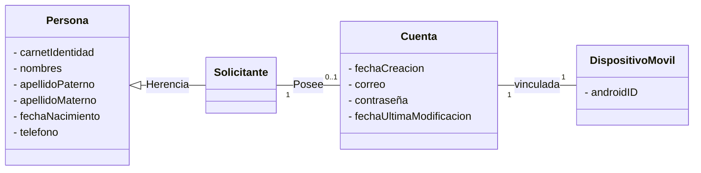

### Modelo de Dominio – MiFicha

```mermaid
classDiagram
    direction LR
    %% Definición de clases y sus atributos
    class Persona {
        - carnetIdentidad
        - nombres
        - apellidoPaterno
        - apellidoMaterno
        - fechaNacimiento
        - telefono
    }

    class Solicitante {
    }

    class Cuenta {
        - fechaCreacion
        - correo
        - contraseña
        - fechaUltimaModificacion
    }

    class DispositivoMovil {
        - androidID
    }

    %% Relaciones
    Persona <|-- Solicitante : Herencia
    Solicitante "1" -- "0..1" Cuenta : Posee
    Cuenta "1" -- "1" DispositivoMovil : vinculada
```
